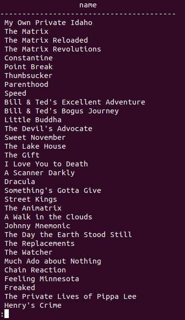
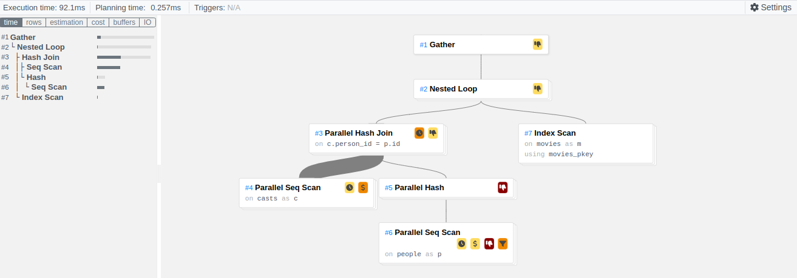
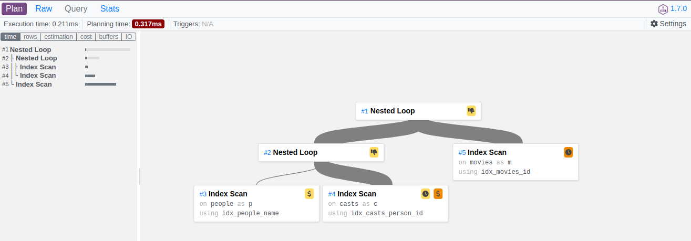

# 🎥 Trabalho prático A3

## Otimização de consultas

📆 **Data de entrega**: 14/02/2020

📝 **Descrição**: Um cliente deseja melhorar o desempenho do seu banco de dados. Para isto, você foi acionado para verificar o que está ocorrendo com o banco de dados. Nesse contexto, sua tarefa é criar consultas e verificar como o SGBD a está implementando. A tarefa será apresentada para o cliente (e a turma ;))

**Banco de dados**: será utilizado o banco disponível neste link https://github.com/credativ/omdb-postgresql

**Tarefa 1**  
Carregar o dataset no SGBD Postgres.

**Tarefa 2**  
Criar duas consultas com joins sobre as tabelas com os maiores número de tuplas;

**Tarefa 3**  
Comparar e reportar o **custo de execução** com e sem índice (usar o comando explain\*). A consulta está utilizando o índice? Executar a consulta 5 vezes e calcular a média e o desvio. Explicar o plano da consulta.
Atentar: Qual algoritmo foi usado para realizar o Join? Explique o seu funcionamento.

## Como carregar o banco de dados

Primeiro, é necessário clonar o repositório do github.

```bash
git clone https://github.com/credativ/omdb-postgresql
```

Caso seu nome de usuário do postgres seja diferente do usuário do sistema, é necessário criar. Para isso, basta executar o comando abaixo.

```bash
sudo -u postgres createuser -s $USER
```

Em seguida, seguindo as instruções do repositório, é necessário criar o banco de dados e carregar os dados.

```bash
cd omdb-postgresql
./download
./import
```

Para acessar o banco de dados, basta executar o comando abaixo.

```bash
sudo -u postgres psql
\c omdb
```

## Análise de desempenho

Para analisar o desempenho das consultas, foi utilizado o comando `EXPLAIN` do Postgres. O comando `EXPLAIN` retorna o plano de execução da consulta, que é composto por uma árvore de operações. Cada nó da árvore representa uma operação que será realizada para executar a consulta. O comando `EXPLAIN` também retorna o custo estimado de cada operação e o custo total da consulta.

O Query plan para cada consulta pode ser encontrado em sua respectiva pasta (ex: query1/query1-sem-index.md).

Foi incluído no documento o plano de execução de cada consulta utilizando o [explain.dalibo.com](https://explain.dalibo.com/), que é uma ferramenta online que permite visualizar o plano de execução de uma consulta.

Todos os cálculos foram realizados utilizando o comando `EXPLAIN ANALYZE`, que além de retornar o plano de execução, também executa a consulta e retorna o tempo de execução.

O tempo de execução de cada consulta foi calculado executando a consulta 5 vezes e calculando a média e o desvio padrão. A resolução de alguns cálculos podem não ter sido incluídos no documento, mas podem ser encontrados [nesta planilha](https://docs.google.com/spreadsheets/d/1-Kdt59DL8dX9xvrQSFzTBdK3uidualAdOoZVBnuLlVA/)

## Consulta 1:

```sql
EXPLAIN ANALYZE SELECT m.name
FROM movies m
JOIN casts c ON m.id = c.movie_id
JOIN people p ON c.person_id = p.id
WHERE p.name = 'Keanu Reeves';
```



### Sem índice:

A saída do comando `EXPLAIN` pode ser encontrada [aqui](./query1/query1-sem-index.md).

Utilizando o explain.dalibo.com, é possível visualizar o plano de execução da consulta.



Este output mostra o plano de execução de uma consulta que seleciona os nomes dos filmes que Keanu Reeves atuou.

O plano consiste em um Gather node seguido por um Nested Loop node. O Gather node coleta os resultados dos trabalhadores paralelos e os agrega para a saída final.

O Nested Loop node tem dois filhos. O primeiro filho é um Parallel Hash Join node, que faz a junção das tabelas casts e people usando um algoritmo de junção hash com a condição de hash na coluna person_id da tabela casts e na coluna id da tabela people. O resultado é filtrado pela condição onde o nome da pessoa é 'Keanu Reeves'.

O segundo filho do Nested Loop node é um Seq Scan node, que faz um scan sequencial na tabela movies. O resultado é filtrado pela condição onde o id do filme é igual ao id do filme obtido na junção anterior.

O Parallel Hash Join node é executado em paralelo por três trabalhadores. O total de tempo de execução é de 1.101 segundos.

**Tempos de execução:**
105.604
154.472
93.279
92.163
92.105

**Cálculo da Média**  
$$ \frac{(105.604 + 154.472 + 93.279 + 92.163 + 92.105)}{5}= 107.525ms$$

**Cálculo do Desvio Padrão**  
$$24.01843879ms$$

### Com índice:

Para otimizar esta query usando indexes, precisamos garantir que existam índices nas colunas de junção e na coluna de filtragem. Neste caso, podemos criar índices nas seguintes colunas:

```sql
CREATE INDEX idx_casts_movie_id ON casts(movie_id);
CREATE INDEX idx_casts_person_id ON casts(person_id);
CREATE INDEX idx_people_name ON people(name);
CREATE INDEX idx_movies_id ON movies (id);
CREATE INDEX idx_movies_name ON movies (name);
```

A saída de `EXPLAIN` pode ser encontrada [aqui](./query1/query1-com-index.md).

O plano de execução da consulta com índice é o mesmo que o plano de execução da consulta sem índice, exceto pelo tipo de junção. O tipo de junção foi alterado de Hash Join para Index Scan.

O Parallel Hash Join node foi substituído por um Parallel Index Scan node. O Parallel Index Scan node faz um scan sequencial no índice idx_casts_person_id, que é um índice B-Tree. O resultado é filtrado pela condição onde o nome da pessoa é 'Keanu Reeves'.



**Tempos de execução:**
0,209
0,387
0,294
0,298
0,211

**Cálculo da Média**
$$\frac{0.209 + 0.387 + 0.294 + 0.298 + 0.211}{5} = 0.280ms$$

**Cálculo do Desvio Padrão**
$$0.06598ms$$

Ambos os planos de execução são executando a mesma consulta, que retorna o nome dos filmes em que Keanu Reeves atuou. No entanto, o primeiro plano de execução é significativamente mais lento que o segundo plano de execução.

O primeiro plano de execução usa execução paralela, o que significa que a consulta é dividida em várias subconsultas que são executadas simultaneamente em diferentes CPUs ou threads. A primeira subconsulta executa um scan sequencial paralelo na tabela casts, que é uma operação muito cara, dada a grande quantidade de linhas na tabela. A segunda subconsulta executa um scan sequencial paralelo na tabela people, filtrando apenas por Keanu Reeves. Os resultados dessas subconsultas são então unidos usando uma junção hash paralela. Finalmente, um scan de índice na tabela movies é executado para cada linha do conjunto de resultados unidos.

A segunda consulta não usa execução paralela. Em vez disso, ela usa scans de índice nas tabelas people, casts e movies para recuperar os resultados. Especificamente, um scan de índice é executado na tabela people para recuperar a linha para Keanu Reeves. Em seguida, um scan de índice é executado na tabela casts para recuperar todas as linhas que correspondem ao ID de Keanu Reeves. Finalmente, um scan de índice é executado na tabela movies para cada linha do conjunto de resultados unidos.

A diferença entre os dois planos é que o primeiro usa paralelismo, o que pode acelerar a execução de consultas para certos tipos de consultas, mas também pode atrasar a execução de consultas para outros. Neste caso, a execução paralela não está ajudando e está tornando a consulta mais lenta, provavelmente devido ao alto custo dos scans sequenciais na tabela casts. A segunda consulta, por outro lado, evita os scans sequenciais caros e usa scans de índice em vez disso, resultando em um tempo de execução da consulta muito mais rápido.

## Consulta 2
Essa query retorna os filmes lançados entre 2012 e 2022 na categoria de ação, juntamente com o nome do filme, a data de lançamento, o nome do membro do elenco que interpretou o papel de um ator e o trabalho que eles desempenharam (Ator). A query pode ser otimizada usando índices nas seguintes colunas: movies.id, movie_categories.movie_id, categories.id, casts.movie_id, people.id, casts.person_id, job_names.job_id, e movies.date.

```sql
EXPLAIN ANALYZE SELECT movies.id, movies.name, movies.date, categories.name as category, people.name as cast_member, job_names.name as job
FROM movies
JOIN movie_categories ON movies.id = movie_categories.movie_id
JOIN categories ON movie_categories.category_id = categories.id
JOIN casts ON movies.id = casts.movie_id
JOIN people ON casts.person_id = people.id
JOIN job_names ON casts.job_id = job_names.job_id
WHERE categories.name = 'Action'
AND job_names.name = 'Actor'
AND movies.date BETWEEN '2010-01-01' AND '2022-12-31'
ORDER BY movies.date DESC, movies.name ASC, job_names.name ASC;
```

### Sem índice:

**Tempos de execução:**

**Cálculo da Média**

**Cálculo do Desvio Padrão**

### Com índice:

**Tempos de execução:**

**Cálculo da Média**

**Cálculo do Desvio Padrão**

# Conclusão

Utilizando os conceitos de otimização de consultas, foi possível identificar os principais gargalos de desempenho de uma consulta e otimizá-la. Além disso, foi possível identificar os tipos de junções mais adequados para cada situação e criar índices para melhorar o desempenho de consultas semelhantes.
